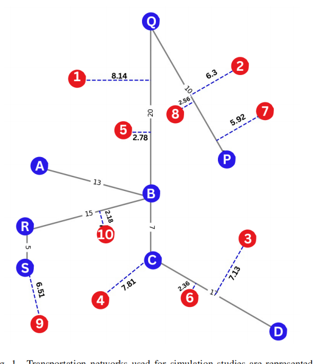
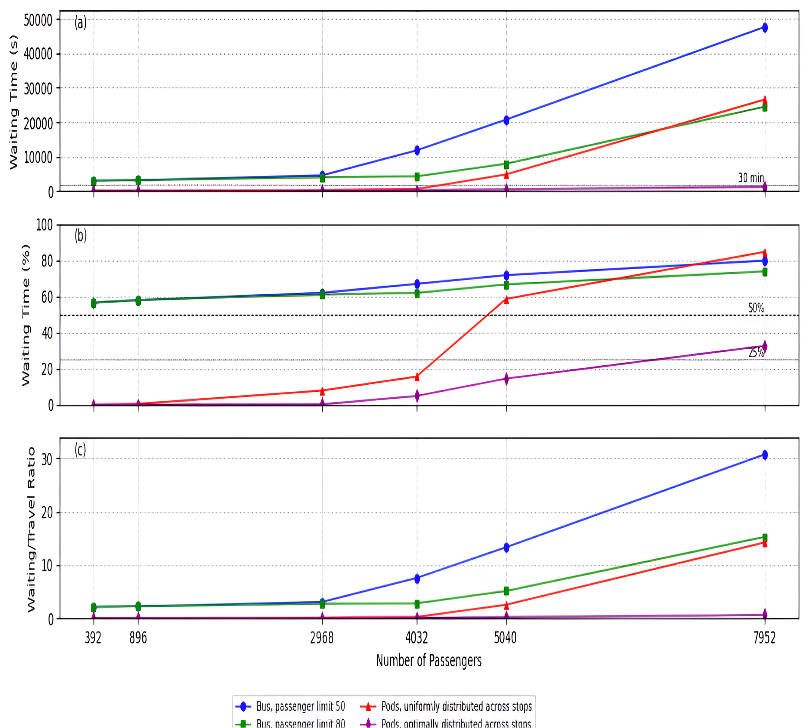
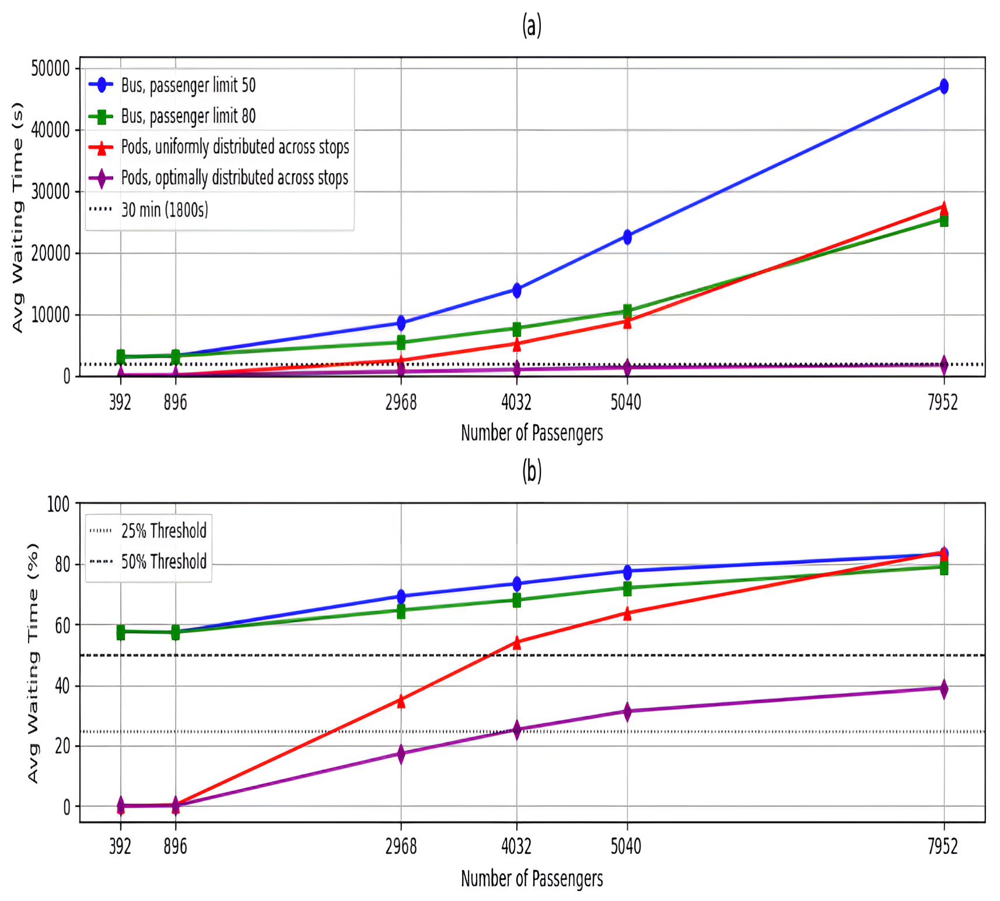
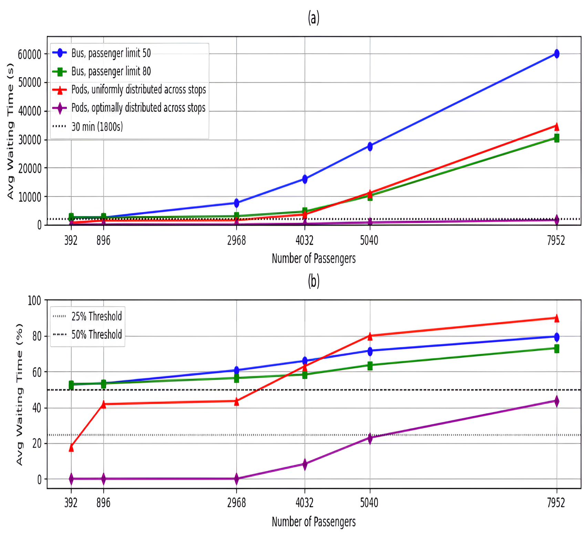
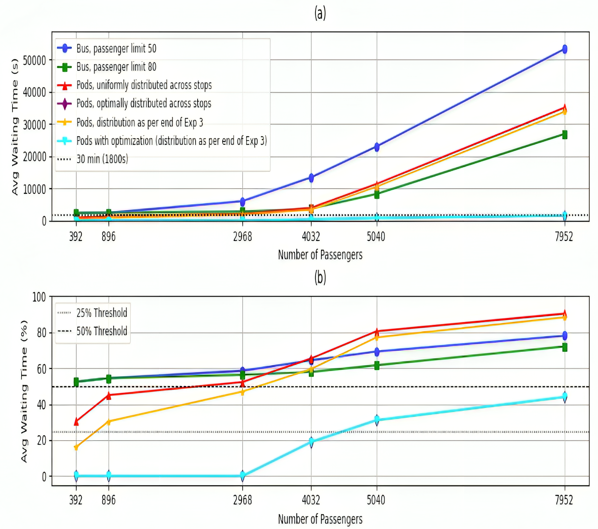

# Simulation-Based Comparative Analysis of Personal Rapid Transit (PRT) and Bus Transportation Systems

This project is a simulation-based comparison of a Pod-based Personal Rapid Transit (PRT) system and a traditional Bus Transportation System. Conducted as part of an internship at Gridflow Technologies, the simulation analyzes passenger experience and transit system efficiency over five experiments under varied spatial and temporal demand conditions.

---

## 🚀 Technologies Used

* **Python** for simulation logic
* **SQLite3** for managing transit data
* **NetworkX** for graph-based pathfinding
* **Matplotlib** for visualization
* **CSV/Pandas** for exporting and analyzing passenger records

---

## 📊 Key Performance Metrics

* **Average passenger waiting time**
* **Percentage of waiting time** w\.r.t. total journey time
* **(Experiment 5 only)**:

  * **Average passenger walking time, Average passenger walking time,Average Total Travel time**
  


---

## 📍 Transportation Network Overview

* **Blue Nodes**: Common stops accessible by **both buses and pods**.
* **Red Nodes**: Additional pod-only stops (included only in **Experiment 5**).

📌 **Network Graph (Pods and Bus Stops):**




---

## ⚙️ Simulation Settings

* Simulation time window: 6 AM - 12 AM (18 hours)
* Buses and pods run until all passengers are served
* Travel speed: 40 km/hr for both buses and pods
* Passenger boarding and de-boarding time: 4 seconds each
* Number of Pods used: **184**
* Number of Buses used: **4**

---

## 🧪 Simulation Experiments

### 🔹 Experiment 1: Basic Graph (Blue Nodes Only)

* **Passenger temporal distribution** – Uniform
* **Passenger spatial distribution** – Uniform

📊 **Plots:**


---

### 🔹 Experiment 2: Basic Graph (Blue Nodes Only)

Assesses the impact of **morning and evening rush hour traffic** typically seen in cities.

* **Passenger temporal distribution** – Bi-modal Gaussian
  (means: 8 AM, 6 PM; std devs: 114 min, 60 min)
* **Passenger spatial distribution** – Uniform


📊 **Plots:**



---

### 🔹 Experiment 3: Basic Graph (Blue Nodes Only)

Simulates **morning movement towards the city center** from outskirts.

* **Passenger temporal distribution** – Uniform
* **Passenger spatial distribution** – 70% destined to stop B, 30% to other stops


📊 **Plots:**



---

### 🔹 Experiment 4: Basic Graph (Blue Nodes Only)

Simulates **evening movement away from the city center** to the outskirts.

* **Passenger temporal distribution** – Uniform
* **Passenger spatial distribution** – 70% starting from stop B, 30% from rest


📊 **Plots:**



---

### 🔹 Experiment 5: Extended Graph (Blue and Red Nodes) for PRT

This experiment tests PRT’s **ability to extend infrastructure** beyond traditional bus reach.

* **Red nodes** were added using a **greedy algorithm** to minimize average walking distance from random passenger positions.
* **Passenger temporal distribution** – Uniform
* **Passenger spatial distribution** – Uniform


📊 **Metrics Compared:**

* Average walking time
* Average waiting time
* Average Total travel time

📊 **Plots:**
.jpg)
.jpg)


---

## 🗂️ Folder Structure Overview

```
- bus simulation/
  ├── Experiment 1 to 5 (simulation + plots)
  ├── BUSS.db / exp5Bus.db
  └── Bus_Simulation_flowchart.jpeg

- pod simulation/
  ├── Experiment 1 to 5 (optimized & unoptimized)
  ├── collide.db (one per experiment)
  └── Pod_Optimization_flowchart.jpg
```

---

## 🤝 Acknowledgments

With contributions from: Sneha Patil, Apoorva Angadi, Ramyashri Kulkarni, Shreya Hiremath  
Special thanks to **Dr. Umesh Rudrapatna** (Gridflow Technologies) for guidance and mentorship.

---
📄 **This study has been accepted for presentation at the 8th Conference of Transportation Research Group of India (TRG 2025).**


## 📌 Notes

* All experiments are self-contained and can be run independently.
* Plots are generated from `.csv` outputs using Matplotlib.
* Flowcharts are provided to clarify simulation logic.
* Visualization is central to analysis, highlighting wait time, journey time, and walking time.

* Feel free to explore the project to understand the simulation flow, design logic, and key results derived from the experiments.
